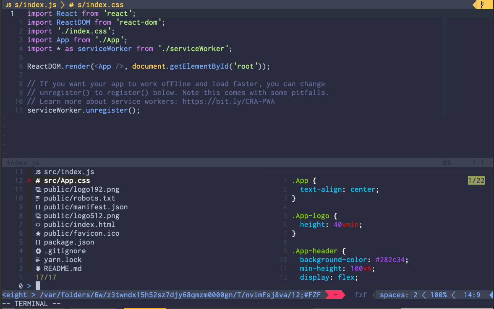
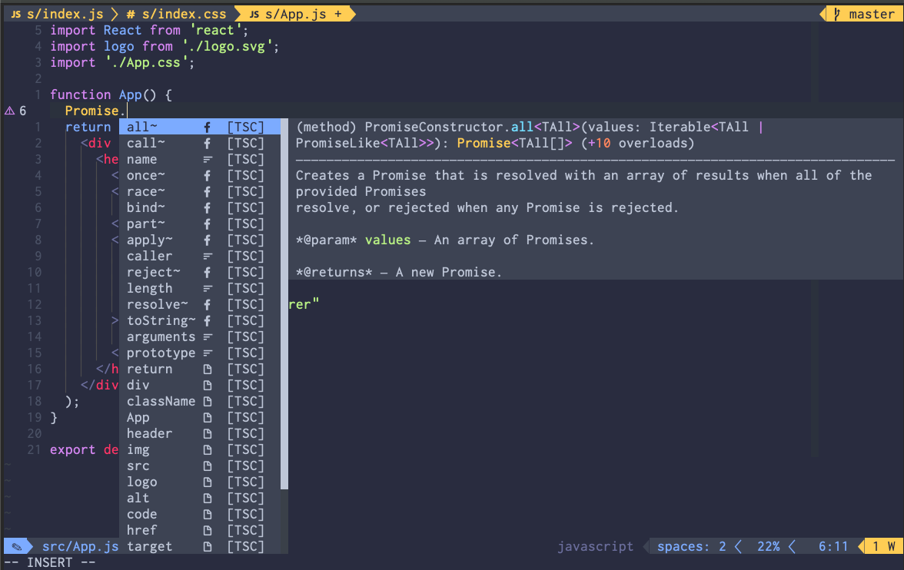
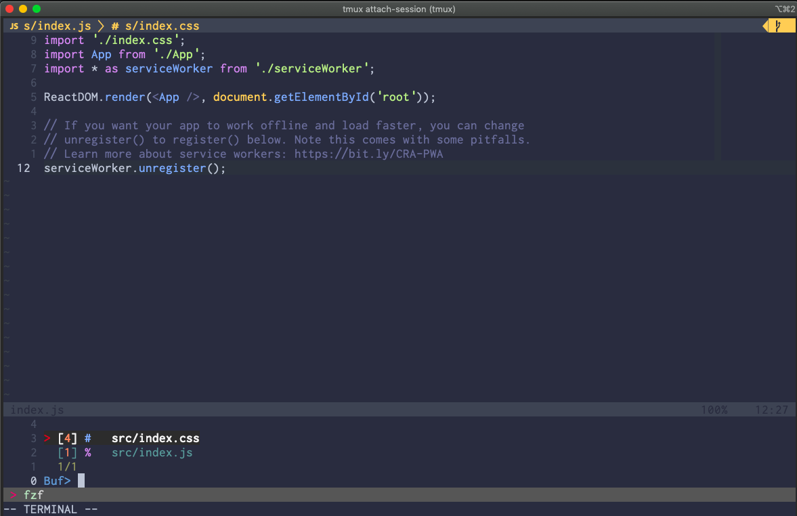

# NVIM

## Dependencies

- ack: 
- bat: 
- fzf: 
- ripgrep:

## Plugins

### Apparence 

- [ drewtempelmeyer/palenight.vim ](https://github.com/drewtempelmeyer/palenight.vim)
- [ ryanoasis/vim-devicons ](https://github.com/ryanoasis/vim-devicons)
- [ itchyny/lightline.vim ](https://github.com/itchyny/lightline.vim)
- [ mengelbrecht/lightline-bufferline ](https://github.com/mengelbrecht/lightline-bufferline)
- [ Yggdroot/indentLine ](https://github.com/Yggdroot/indentLine)

### IDE 

- [ junegunn/fzf ](https://github.com/junegunn/fzf)
- [ junegunn/fzf.vim ](https://github.com/junegunn/fzf.vim)
- [ neoclide/coc.nvim ](https://github.com/neoclide/coc.nvim)
- [ tpope/vim-surround ](https://github.com/tpope/vim-surround)
- [ tpope/vim-repeat ](https://github.com/tpope/vim-repeat)
- [ Raimondi/delimitMate ](https://github.com/Raimondi/delimitMate)
- [ dyng/ctrlsf.vim ](https://github.com/dyng/ctrlsf.vim)
- [ tomtom/tcomment_vim ](https://github.com/tomtom/tcomment_vim)
- [ prettier/vim-prettier ](https://github.com/prettier/vim-prettier)
- [ jingmiao/auto-pairs ](https://github.com/jiangmiao/auto-pairs)
- [ matze/vim-move ](https://github.com/matze/vim-move)

### Development

- [ sheerun/vim-polyglot ](https://github.com/sheerun/vim-polyglot)
- [ w0rp/ale ](https://github.com/w0rp/ale)
- [ mattn/emmet-vim ](https://github.com/mattn/emmet-vim)

### Git 

- [ airblade/vim-gitgutter ](https://github.com/mattn/emmet-vim)
- [ tpope/vim-fugitive ](https://github.com/mattn/emmet-vim)

## Commands
| keys          | remap         | effect                        |
|---------------|:-------------:|------------------------------:|
| ,             | \<Leader>     |                               |
| jj            | \<esc>        |                               |
| \<control>s   | :w            |                               |
| \<leader>w    | :bd           | Close current buffer          |
| \<esc>        | :noh          | Clear search highlight        |
| \<Leader>     | gcc           | Comment a line                |
| \<Leader>h    | <C-w>s        | Open horizontal split         |
| \<Leader>v    | <C-w>v        | Open vertical split           |
| \<shift>-     | <C-w>5<       | Resize current window         |
| \<shift>+     | <C-w>5>       | Resize current window         |
| \<control>p   |               | FZF                           |
| \<control>v   | FZF mode      | Open vertical split           |
| \<shift>↑     | FZF mode      | Move throught preview         |
| \<shift>↓     | FZF mode      | Move throught preview         |
| \<control>u   | FZF mode      | Move throught preview         |
| \<control>d   | FZF mode      | Move throught preview         |
| \<Leader>b    | :Buffers      | Navigate among buffers        |
| \<Leader>g    | :GFiles?      | Git Diff                      |
| \<shift>↑     | Git diff      | Move throught preview         |
| \<shift>↓     | Git diff      | Move throught preview         |
| \<Leader>p    |               | Autoformat with Prettier      |
| \<Leader>e    | :lopen        | Open ALE error list           |
| \<Leader>E    | :lopen        | Close ALE error list          |
| \<Leader>f    | CtrlSFPrompt  | Search a word among files     |

## Screenshots

